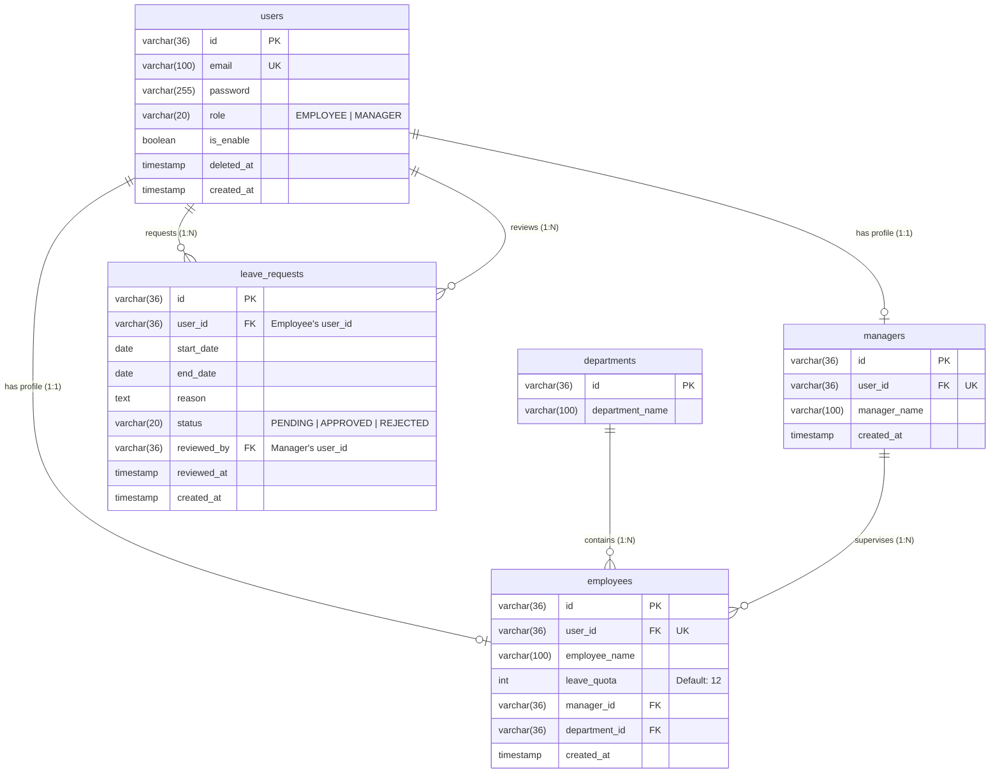

# Employee Leave Management System

Sistem Manajemen Cuti Karyawan (Employee Leave Management System) adalah aplikasi backend berbasis **Java 21** dan **Spring Boot 3.5.x** yang dirancang untuk mengelola proses pengajuan, validasi, dan persetujuan cuti karyawan di sebuah organisasi secara efisien dan aman.

Aplikasi ini menggunakan **Spring Security & JWT** untuk otentikasi serta otorisasi berbasis peran (*Role-Based Access Control*), membedakan akses antara **EMPLOYEE** (Karyawan) dan **MANAGER** (Manajer).

---

## 🛠️ Teknologi & Fitur Utama

- **Core Framework**: [Spring Boot 3.5.14](https://spring.io/projects/spring-boot) & **Java 21**
- **Data Persistence**: [Spring Data JPA](https://spring.io/projects/spring-data-jpa) & **Hibernate**
- **Database**: [PostgreSQL](https://www.postgresql.org/) (sebagai database utama)
- **Database Migrations**: [Flyway](https://flywaydb.org/) (untuk versioning & kontrol skema database)
- **Security**: [Spring Security](https://spring.io/projects/spring-security) & [JSON Web Token (JWT)](https://jwt.io/)
- **API Documentation**: [Springdoc OpenAPI / Swagger UI](https://springdoc.org/)
- **Utility & Productivity**: [Lombok](https://projectlombok.org/)
- **Containerization**: [Docker](https://www.docker.com/) & [Docker Compose](https://docs.docker.com/compose/)

---

## 📊 Skema Database & Relasi (ERD)

Aplikasi ini menggunakan database relasional PostgreSQL dengan desain skema yang memisahkan data akun otentikasi (`users`) dari profil bisnis (`employees` dan `managers`). Hal ini mempermudah perluasan sistem jika di kemudian hari terdapat tipe profil baru.

### 1. Diagram Relasi Entitas (ERD - Mermaid)

Berikut adalah visualisasi hubungan antartabel di dalam database:



### 2. Penjelasan Detail Tabel

#### A. Tabel `users`
Menyimpan data otentikasi akun pengguna.
- `id` (VARCHAR(36), PK): UUID unik untuk setiap user.
- `email` (VARCHAR(100), UNIQUE, NOT NULL): Alamat email sebagai username untuk login.
- `password` (VARCHAR(255), NOT NULL): Hash password yang aman menggunakan **BCrypt**.
- `role` (VARCHAR(20), NOT NULL): Hak akses user, memiliki constraint check: `EMPLOYEE` atau `MANAGER`.
- `is_enable` (BOOLEAN, DEFAULT TRUE): Status keaktifan akun. Akun yang tidak aktif (`false`) tidak dapat login.
- `deleted_at` (TIMESTAMP, NULLABLE): Menyimpan waktu soft-delete.
- `created_at` (TIMESTAMP, DEFAULT NOW()): Waktu pembuatan akun.

#### B. Tabel `departments`
Menyimpan informasi departemen atau divisi perusahaan.
- `id` (VARCHAR(36), PK): ID departemen.
- `department_name` (VARCHAR(100), NOT NULL): Nama departemen (misal: *Engineering*, *Human Resource*, *Finance*).

#### C. Tabel `managers`
Menyimpan profil detail untuk pengguna bersubjek **MANAGER**.
- `id` (VARCHAR(36), PK): ID profil manajer.
- `user_id` (VARCHAR(36), FK, UNIQUE): Berelasi *One-to-One* ke `users.id`.
- `manager_name` (VARCHAR(100), NOT NULL): Nama lengkap manajer.
- `created_at` (TIMESTAMP, DEFAULT NOW()): Waktu profil dibuat.

#### D. Tabel `employees`
Menyimpan profil detail untuk pengguna bersubjek **EMPLOYEE**.
- `id` (VARCHAR(36), PK): ID profil karyawan.
- `user_id` (VARCHAR(36), FK, UNIQUE): Berelasi *One-to-One* ke `users.id`.
- `employee_name` (VARCHAR(100), NOT NULL): Nama lengkap karyawan.
- `leave_quota` (INT, DEFAULT 12): Jatah cuti tahunan karyawan (bawaan adalah 12 hari).
- `manager_id` (VARCHAR(36), FK, NULLABLE): Atasan langsung karyawan, berelasi *Many-to-One* ke `managers.id`.
- `department_id` (VARCHAR(36), FK, NULLABLE): Departemen tempat karyawan bekerja, berelasi *Many-to-One* ke `departments.id`.
- `created_at` (TIMESTAMP, DEFAULT NOW()): Waktu profil dibuat.

#### E. Tabel `leave_requests`
Menyimpan data transaksi pengajuan cuti karyawan.
- `id` (VARCHAR(36), PK): ID pengajuan cuti.
- `user_id` (VARCHAR(36), FK): Pengaju cuti, berelasi *Many-to-One* ke `users.id`.
- `start_date` (DATE, NOT NULL): Tanggal mulai cuti.
- `end_date` (DATE, NOT NULL): Tanggal selesai cuti.
- `reason` (TEXT, NOT NULL): Alasan pengajuan cuti.
- `status` (VARCHAR(20), DEFAULT 'PENDING'): Status pengajuan cuti, memiliki constraint check: `PENDING`, `APPROVED`, atau `REJECTED`.
- `reviewed_by` (VARCHAR(36), FK, NULLABLE): Manajer yang menyetujui/menolak pengajuan, berelasi *Many-to-One* ke `users.id`.
- `reviewed_at` (TIMESTAMP, NULLABLE): Waktu ketika keputusan persetujuan/penolakan diambil.
- `created_at` (TIMESTAMP, DEFAULT NOW()): Tanggal pengajuan dibuat.

---

## Alur Bisnis & Validasi Cuti

Sistem ini menerapkan validasi bisnis yang ketat saat proses pengajuan cuti dilakukan oleh karyawan (`LeaveRequestServiceImpl`):

1. **Validasi Rentang Tanggal**:
   - Tanggal mulai cuti (`start_date`) tidak boleh lebih besar (setelah) tanggal selesai cuti (`end_date`).
2. **Validasi Tumpang Tindih (Overlapping Request)**:
   - Karyawan tidak diperbolehkan mengajukan cuti pada tanggal yang menabrak/tumpang tindih dengan pengajuan cuti mereka yang **sudah disetujui** (`APPROVED`).
3. **Validasi Sisa Kuota Cuti (Quota Check)**:
   - Sistem akan menghitung total hari cuti yang telah diambil (`APPROVED`) oleh karyawan tersebut pada **tahun berjalan** (`EXTRACT(YEAR FROM lr.start_date)`).
   - Pengajuan cuti baru hanya diperbolehkan jika: `Total Hari Cuti Disetujui + Hari Cuti Baru <= Jatah Kuota Karyawan` (bawaan jatah kuota = 12 hari).
4. **Persetujuan & Penolakan (Approval & Rejection)**:
   - Pengajuan baru otomatis bertipe `PENDING`.
   - Hanya **MANAGER** yang berhak menyetujui (`/api/leaves/{id}/approve`) atau menolak (`/api/leaves/{id}/reject`) pengajuan cuti.
   - Status pengajuan hanya dapat diubah jika status sebelumnya adalah `PENDING`. Jika statusnya sudah disetujui/ditolak, status tidak dapat diubah lagi.

---

## Struktur Direktori Project

Project ini mengikuti arsitektur berlapis (*Layered Architecture*) standar Spring Boot yang bersih dan mudah dipelihara:

```text
src/main/java/com/basscode/employee_leave_management/
├── config/                 # Konfigurasi aplikasi (seperti OpenAPI/Swagger)
├── controller/             # REST Controller untuk mengekspos API endpoints
├── dto/                    # Data Transfer Objects untuk Request & Response API
│   ├── request/
│   └── response/
├── entity/                 # JPA Entity yang merepresentasikan tabel database
├── enums/                  # Konstanta Enum (Role, LeaveStatus)
├── exception/              # Manajemen exception global (GlobalExceptionHandler)
├── logging/                # Utilitas logging aplikasi
├── repository/             # Spring Data JPA Repository (akses database)
├── security/               # Konfigurasi Security, JWT Filter, & UserDetails
└── service/                # Business Logic layer
    └── impl/               # Implementasi Service
```

---

## Cara Menjalankan Aplikasi Secara Lokal

### Prasyarat
- **Java Development Kit (JDK) 21**
- **Maven** (atau menggunakan `./mvnw` bawaan)
- **Docker & Docker Compose**

### 1. Menjalankan Database PostgreSQL Menggunakan Docker
Kami telah menyediakan konfigurasi `docker-compose.yaml` untuk mempermudah setup database secara instan beserta inisialisasi container aplikasi.

Jalankan perintah berikut pada direktori root project untuk menjalankan PostgreSQL:
```bash
docker-compose up -d postgres
```
*Database PostgreSQL akan berjalan pada port `5432` dengan nama database `employee_leave_db`.*

### 2. Mengkonfigurasi Environment
Salin berkas `.env` (atau pastikan nilainya sudah sesuai) di root project untuk mengatur kredensial aplikasi:
```properties
POSTGRES_PASSWORD=postgres123
JWT_SECRET=ZW1wbG95ZWUtbGVhdmUtbWFuYWdlbWVudC1hc3Nlc3NtZW50LTIwMjYtcHQtbGF3ZW5jb24taW50ZXJuYXRpb25hbC1iYXNzY29kZQ==
JWT_EXPIRATION=86400000
```

### 3. Menjalankan Aplikasi
Anda dapat menjalankan aplikasi Spring Boot menggunakan Maven:
```bash
./mvnw spring-boot:run
```
Saat pertama kali aplikasi dijalankan, **Flyway** secara otomatis akan mendeteksi file migrasi SQL di folder `db/migration/` lalu:
1. Membuat tabel-tabel database sesuai dengan file migrasi `V1` dan `V2`.
2. Melakukan seeding data awal pengujian sesuai dengan file migrasi `V3`.

---

## Akun Pengujian (Seeded Data)

Berikut adalah daftar user yang telah disiapkan secara otomatis di database (semua akun menggunakan password: **`password123`**):

| Nama | Email / Username | Role | Departemen | Sisa Kuota |
| :--- | :--- | :--- | :--- | :---: |
| **Budi Santoso** | `budi.santoso@example.com` | **MANAGER** | - | - |
| **Siti Rahayu** | `siti.rahayu@example.com` | **MANAGER** | - | - |
| **Andi Wijaya** | `andi.wijaya@example.com` | **EMPLOYEE** | Engineering | 12 hari (sudah pakai 5) |
| **Dewi Kusuma** | `dewi.kusuma@example.com` | **EMPLOYEE** | Human Resource | 12 hari (sudah pakai 3) |
| **Riko Pratama** | `riko.pratama@example.com` | **EMPLOYEE** | Finance | 12 hari |
| **Inactive User** | `inactive.user@example.com` | **EMPLOYEE** | Engineering | Akun Dinonaktifkan |

---

## API Endpoints & Dokumentasi

Setelah aplikasi berhasil dijalankan, Anda dapat mengakses dokumentasi API interaktif dan mencoba request langsung melalui Swagger UI di alamat berikut:

**[http://localhost:8080/swagger-ui.html](http://localhost:8080/swagger-ui.html)**

### Ringkasan Endpoint

#### Otorisasi (Auth)
- **POST** `/api/auth/login`
  - *Deskripsi*: Melakukan otentikasi menggunakan email & password.
  - *Kembalian*: Token JWT (Bearer Token).
  - *Akses*: Public.

#### Manajemen Cuti (Leaves)
- **POST** `/api/leaves`
  - *Deskripsi*: Membuat pengajuan cuti baru.
  - *Akses*: Khusus **EMPLOYEE** (membutuhkan JWT Token).
- **GET** `/api/leaves/my-leaves`
  - *Deskripsi*: Melihat riwayat/histori cuti milik diri sendiri (paginated).
  - *Akses*: Khusus **EMPLOYEE** (membutuhkan JWT Token).
- **GET** `/api/leaves`
  - *Deskripsi*: Melihat seluruh pengajuan cuti dari semua karyawan (paginated).
  - *Akses*: Khusus **MANAGER** (membutuhkan JWT Token).
- **PUT** `/api/leaves/{id}/approve`
  - *Deskripsi*: Menyetujui pengajuan cuti tertentu.
  - *Akses*: Khusus **MANAGER** (membutuhkan JWT Token).
- **PUT** `/api/leaves/{id}/reject`
  - *Deskripsi*: Menolak pengajuan cuti tertentu.
  - *Akses*: Khusus **MANAGER** (membutuhkan JWT Token).
